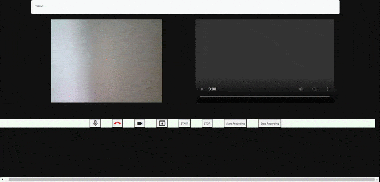

pour lancer le projet : ouvrir index.html sur le navigateur

l'écran de gauche "stream" la webcam et l'audio, pour lancer l'enregistrement, cliquer sur les boutons start/stop, ça enregistrera dans le deuxième écran.

j'ai rendu la première vidéo draggable, pour faire comme google meet, pas tout à fait finie.
le bouton material.io en bas à droite n'est pas fonctionnel.

